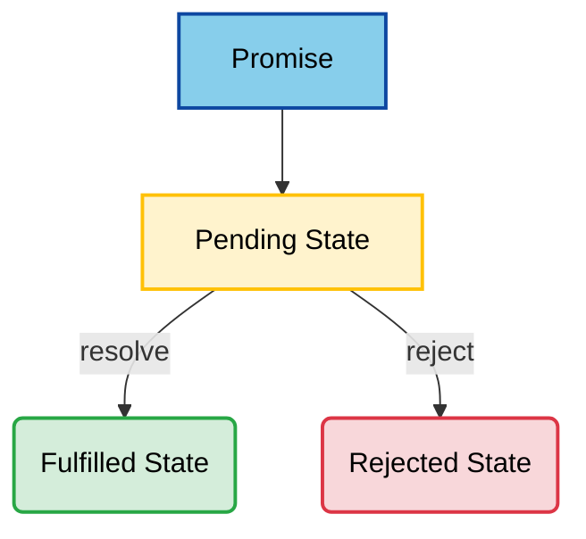
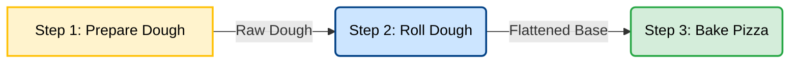

# Contents

1. [`var`, `let`, and `const` ](#1--var-let-and-const)
2. [Functions](#2--functions)
3. [Objects, Arrays, Destructuring, and the Spread Operator](#3--objects-arrays-destructuring-and-the-spread-operator)
4. [Array Methods Every React Developer Must Master](#4--array-methods-every-react-developer-must-master)
5. [JavaScript Modules (`import` and `export`)](#5--javascript-modules-import-and-export)
6. [Asynchronous JavaScript: Callbacks, Promises, async, and await](#6--asynchronous-javascript-callbacks-promises-async-and-await)
7. [The JavaScript Event Loop](#7--the-javascript-event-loop)
8. [Error Handling in JavaScript](#8--error-handling-in-javascript)

---

# 1- `var`, `let`, and `const` 

## 🎯 Objectives

- Why `var` is considered legacy.
- The difference between `var`, `let`, and `const`.
- Scope.
- Hoisting.
- Reassignment.
- Which one React developers use.
- Common interview questions.

---

# Why Do We Need This?

Suppose you see React code like:

```javascript
const [count, setCount] = useState(0);
```

Why `const`?

Why not `let`?

Why not `var`?

You'll know the answer after this lesson.

---

# JavaScript Variables

A variable stores data.

Example:

```javascript
let name = "Utpal";
```

Here,

```
name
```

stores

```
"Utpal"
```

---

# JavaScript Has Three Ways to Declare Variables

```javascript
var
```

```javascript
let
```

```javascript
const
```

Although all three declare variables, they behave differently.

---

# Before ES6

Before 2015, JavaScript only had

```javascript
var
```

This caused many bugs.

ES6 (ECMAScript 2015) introduced

```javascript
let
```

and

```javascript
const
```

to solve many of those problems.

---

# `var`

Example

```javascript
var age = 25;

age = 30;

console.log(age);
```

Output

```text
30
```

`var` allows reassignment.

---

# `let`

Example

```javascript
let age = 25;

age = 30;

console.log(age);
```

Output

```text
30
```

`let` also allows reassignment.

---

# `const`

```javascript
const age = 25;
```

Now try

```javascript
age = 30;
```

Output

```text
TypeError: Assignment to constant variable.
```

A `const` variable **cannot be reassigned**.

---

# First Difference

| Variable | Can Reassign? |
|-----------|---------------|
| `var` | ✅ Yes |
| `let` | ✅ Yes |
| `const` | ❌ No |

---

# Scope

This is the biggest difference.

---

## Function Scope (`var`)

```javascript
function demo() {

    if (true) {

        var x = 10;

    }

    console.log(x);

}

demo();
```

Output

```text
10
```

Although `x` was declared inside the `if` block, it is visible throughout the function.

---

## Block Scope (`let`)

```javascript
function demo() {

    if (true) {

        let x = 10;

    }

    console.log(x);

}

demo();
```

Output

```text
ReferenceError: x is not defined
```

`x` exists only inside the block.

---

## Block Scope (`const`)

```javascript
function demo() {

    if (true) {

        const x = 10;

    }

    console.log(x);

}

demo();
```

Output

```text
ReferenceError: x is not defined
```

`const` is also block-scoped.

---

# Visual

## `var`

```text
function

├─────────────────────────────┐
│                             │
│ if                          │
│     var x                   │
│                             │
└─────────────────────────────┘

x is visible everywhere inside the function.
```

---

## `let` / `const`

```text
function

├─────────────────────────────┐
│                             │
│ if                          │
│     let x                   │
│                             │
└─────────────────────────────┘

x exists only inside the if block.
```

---

# Why Block Scope is Better

Imagine a React component:

```javascript
if (user.isAdmin) {

    let message = "Welcome Admin";

}
```

Outside the block,

`message` should not exist.

Block scope prevents accidental bugs.

---

# Redeclaration

## `var`

```javascript
var name = "Utpal";

var name = "John";

console.log(name);
```

Output

```text
John
```

Allowed.

---

## `let`

```javascript
let name = "Utpal";

let name = "John";
```

Output

```text
SyntaxError
```

Not allowed.

---

## `const`

```javascript
const name = "Utpal";

const name = "John";
```

Also produces a

```text
SyntaxError
```

---

# Hoisting

JavaScript moves variable **declarations** to the top of their scope.

This behavior is called **Hoisting**.

---

## `var`

```javascript
console.log(a);

var a = 10;
```

Output

```text
undefined
```

Internally JavaScript behaves like:

```javascript
var a;

console.log(a);

a = 10;
```

---

## `let`

```javascript
console.log(a);

let a = 10;
```

Output

```text
ReferenceError
```

---

## `const`

```javascript
console.log(a);

const a = 10;
```

Output

```text
ReferenceError
```

---

# Temporal Dead Zone (TDZ)

For `let` and `const`,

the variable exists,

but **cannot be accessed before its declaration**.

Example:

```javascript
console.log(score);

let score = 100;
```

Output

```text
ReferenceError
```

The time between entering the scope and the declaration is called the **Temporal Dead Zone (TDZ)**.

---

# `const` Does NOT Mean Immutable

Many beginners think

```
const
```

means

```
cannot change
```

Not always.

Example

```javascript
const person = {

    name: "Utpal"

};

person.name = "John";

console.log(person);
```

Output

```javascript
{
  name: "John"
}
```

This works because the object itself has not changed.

Only one property changed.

---

# But This Does Not Work

```javascript
const person = {

    name: "Utpal"

};

person = {};
```

Output

```text
TypeError
```

You cannot assign a completely new object to a `const` variable.

---

# Which One Should We Use?

Professional JavaScript developers generally follow this rule:

```text
Need reassignment?

        │
        ▼

      Yes
        │
        ▼

      let

        ▲
        │

      No
        │
        ▼

     const
```

Use `var` only when maintaining legacy JavaScript code.

---

# React Convention

You'll see code like:

```javascript
const App = () => {

    const name = "Utpal";

    const age = 45;

    return (
        <h1>Hello</h1>
    );

};
```

Notice:

Almost everything is declared using `const`.

Because React components rarely reassign variables.

---

# Arrays with `const`

```javascript
const numbers = [1, 2, 3];

numbers.push(4);

console.log(numbers);
```

Output

```text
[1, 2, 3, 4]
```

This is perfectly valid.

The array reference didn't change.

Only its contents changed.

---

# Best Practices

✅ Prefer `const`.

✅ Use `let` only when reassignment is required.

❌ Avoid `var` in new projects.

---

# Hands-on Exercise

Create a file:

```text
variables.js
```

Write:

```javascript
var x = 10;
let y = 20;
const z = 30;

console.log(x);
console.log(y);
console.log(z);
```

Now try:

```javascript
x = 100;
y = 200;
z = 300;
```

Observe the result.

---

Next, write:

```javascript
if (true) {

    let a = 5;

    const b = 6;

    var c = 7;

}

console.log(c);
console.log(a);
console.log(b);
```

Predict the output before running the code.

---

# Interview Questions

### Q1

What is the difference between `var`, `let`, and `const`?

---

### Q2

What is block scope?

---

### Q3

What is hoisting?

---

### Q4

What is the Temporal Dead Zone (TDZ)?

---

### Q5

Why do React developers prefer `const`?

---

# Key Takeaways

- `var` is function-scoped and should generally be avoided in modern JavaScript.
- `let` and `const` are block-scoped.
- `const` prevents reassignment, but **does not** make objects or arrays immutable.
- Use `let` only when reassignment is necessary.
- Most React code uses `const`.

---

# Summary

`let` and `const` were introduced in ES6 to solve many problems caused by `var`.

Understanding scope, reassignment, hoisting, and the Temporal Dead Zone is essential before learning React because these concepts appear throughout React components and hooks.

---

# 2- Functions

---

# 🎯 Objectives

- Function Declarations
- Function Expressions
- Arrow Functions
- Parameters and Return Values
- Implicit Return
- Default Parameters
- Rest Parameters
- The `this` keyword (conceptually)
- Why React uses Arrow Functions extensively

---

# Introduction

A function is simply a reusable block of code.

Instead of writing the same code repeatedly,

you write it once and call it whenever needed.

Example:

```javascript
console.log("Hello");
console.log("Hello");
console.log("Hello");
```

Better:

```javascript
function greet() {
    console.log("Hello");
}

greet();
greet();
greet();
```

---

# Function Declaration

The traditional way.

```javascript
function greet() {
    console.log("Hello");
}

greet();
```

Output

```text
Hello
```

---

# Function with Parameters

```javascript
function greet(name) {
    console.log("Hello " + name);
}

greet("Utpal");
greet("John");
```

Output

```text
Hello Utpal
Hello John
```

Parameters allow functions to work with different values.

---

# Function Returning a Value

```javascript
function add(a, b) {
    return a + b;
}

let result = add(5, 7);

console.log(result);
```

Output

```text
12
```

---

# Why Return?

Without `return`,

the result stays inside the function.

```javascript
function square(x) {
    return x * x;
}

let value = square(8);

console.log(value);
```

Output

```text
64
```

---

# Function Expression

A function can also be stored inside a variable.

```javascript
const greet = function () {
    console.log("Hello");
};

greet();
```

Notice

The function has no name.

The variable stores the function.

---

# Why Store a Function?

Because in JavaScript,

functions are values.

Just like numbers.

```javascript
const x = 10;
```

stores a number.

```javascript
const greet = function () {};
```

stores a function.

---

# Functions are First-Class Citizens

JavaScript treats functions like any other value.

You can

- store them
- pass them
- return them

Example

```javascript
function greet() {
    console.log("Hello");
}

const sayHello = greet;

sayHello();
```

Output

```text
Hello
```

---

# Arrow Functions

Introduced in ES6.

Traditional

```javascript
function add(a, b) {
    return a + b;
}
```

Arrow version

```javascript
const add = (a, b) => {
    return a + b;
};
```

Same output.

Shorter syntax.

---

# Anatomy of an Arrow Function

```javascript
const add = (a, b) => {

    return a + b;

};
```

Read it as:

```
Parameters

↓

(a, b)

↓

Arrow

↓

Function Body
```

---

# Single Parameter

Parentheses are optional.

```javascript
const square = x => {
    return x * x;
};
```

Equivalent to

```javascript
const square = (x) => {
    return x * x;
};
```

---

# No Parameters

Use empty parentheses.

```javascript
const greet = () => {
    console.log("Hello");
};
```

---

# Implicit Return

Suppose the function contains only one expression.

Instead of

```javascript
const square = x => {
    return x * x;
};
```

You can write

```javascript
const square = x => x * x;
```

Output

```javascript
console.log(square(5));
```

```text
25
```

The value is returned automatically.

This is called **Implicit Return**.

---

# Returning Objects

This surprises many beginners.

Incorrect

```javascript
const person = () => {
    name: "Utpal";
};
```

Output

```text
undefined
```

Correct

```javascript
const person = () => ({
    name: "Utpal"
});
```

Objects must be wrapped in parentheses.

---

# Default Parameters

Traditional

```javascript
function greet(name = "Guest") {
    console.log("Hello " + name);
}

greet();
greet("Utpal");
```

Output

```text
Hello Guest
Hello Utpal
```

---

# Rest Parameters

Suppose you don't know how many numbers will arrive.

```javascript
function sum(...numbers) {

    console.log(numbers);

}

sum(1,2,3,4);
```

Output

```javascript
[1,2,3,4]
```

`...`

collects all remaining arguments into an array.

---

# Why React Loves Arrow Functions

React components are usually written like this:

```javascript
const App = () => {

    return (
        <h1>Hello React</h1>
    );

};
```

Why?

Because

- shorter syntax
- cleaner code
- consistent style
- predictable behavior with `this`

---

# The `this` Problem

This is one of JavaScript's most confusing topics.

We'll learn it fully later.

For now,

understand the difference.

Traditional function

```javascript
const person = {

    name: "Utpal",

    greet: function () {

        console.log(this.name);

    }

};

person.greet();
```

Output

```text
Utpal
```

---

# Arrow Function and `this`

```javascript
const person = {

    name: "Utpal",

    greet: () => {

        console.log(this.name);

    }

};

person.greet();
```

Output

```text
undefined
```

Why?

Arrow functions **do not create their own `this`**.

Instead,

they inherit `this` from the surrounding scope.

We'll study this deeply in a later lesson.

---

# Comparing Styles

Traditional

```javascript
function multiply(a,b){

    return a*b;

}
```

Function Expression

```javascript
const multiply = function(a,b){

    return a*b;

};
```

Arrow

```javascript
const multiply = (a,b)=>{

    return a*b;

};
```

Implicit Return

```javascript
const multiply = (a,b)=>a*b;
```

All produce the same result.

---

# Real React Examples

Event Handler

```javascript
const handleClick = () => {

    console.log("Clicked");

};
```

Button

```jsx
<button onClick={handleClick}>
    Click
</button>
```

---

Array Mapping

```javascript
const numbers = [1,2,3];

const squares = numbers.map(
    n => n * n
);

console.log(squares);
```

Output

```text
[1,4,9]
```

Arrow functions make array methods concise.

---

# Common Mistakes

❌ Forgetting `return`

```javascript
const add = (a,b)=>{
    a+b;
}
```

Returns

```text
undefined
```

Correct

```javascript
const add = (a,b)=>{
    return a+b;
}
```

or

```javascript
const add = (a,b)=>a+b;
```

---

❌ Returning an object incorrectly

Wrong

```javascript
()=>{

    name:"Utpal"

}
```

Correct

```javascript
()=>({

    name:"Utpal"

})
```

---

# Best Practices

✅ Use Function Declarations for utility functions when appropriate.

✅ Use Arrow Functions for React components and callbacks.

✅ Prefer `const` with Arrow Functions.

✅ Use implicit return only for short, simple expressions.

---

# Hands-on Exercise

Create

```text
functions.js
```

Write

```javascript
function greet(name) {
    return "Hello " + name;
}

console.log(greet("Utpal"));
```

Now convert it into

1. Function Expression

2. Arrow Function

3. Arrow Function with Implicit Return

Verify that all three produce the same output.

---

Next

Write

```javascript
const numbers = [10,20,30,40];

const doubled = numbers.map(
    n => n * 2
);

console.log(doubled);
```

Predict the output before running it.

---

# Interview Questions

### Q1

Difference between a Function Declaration and a Function Expression?

---

### Q2

What is an Arrow Function?

---

### Q3

What is Implicit Return?

---

### Q4

Why do React developers prefer Arrow Functions?

---

### Q5

How does `this` behave differently in Arrow Functions?

---

# Key Takeaways

- JavaScript functions are first-class values.
- Arrow Functions provide a shorter syntax.
- Arrow Functions support implicit return.
- React components are commonly written as Arrow Functions.
- Arrow Functions inherit `this` from their surrounding scope.
- Default and Rest Parameters make functions more flexible.

---

# Summary

Functions are one of JavaScript's most powerful features.

Modern JavaScript heavily uses Arrow Functions because they are concise, expressive, and fit naturally with React's component-based architecture.

Understanding functions is essential before learning array methods, asynchronous programming, and React Hooks.

---


# 3- Objects, Arrays, Destructuring, and the Spread Operator

---

# 🎯 Objectives

- Objects
- Arrays
- Accessing properties
- Dot vs Bracket notation
- Object Destructuring
- Array Destructuring
- Spread Operator (`...`)
- Rest Operator (`...`)
- Why React uses destructuring everywhere
- Immutable updates

---

# Introduction

React applications manipulate data continuously.

Almost every piece of data in React is either

- an Object
- an Array

Understanding them deeply is essential.

---

# Objects

An object stores related information.

Example

```javascript
const person = {
    name: "Ravi",
    age: 45,
    city: "Bhubaneswar"
};
```

Think of an object as

```text
Person

├── name
├── age
└── city
```

---

# Accessing Properties

## Dot Notation

```javascript
console.log(person.name);
```

Output

```text
Utpal
```

---

## Bracket Notation

```javascript
console.log(person["name"]);
```

Output

```text
Utpal
```

Both are correct.

---

# When to Use Bracket Notation

Suppose

```javascript
const property = "age";
```

Now

```javascript
console.log(person[property]);
```

Output

```text
45
```

This is impossible with dot notation.

---

# Updating Properties

```javascript
person.city = "Cuttack";

console.log(person);
```

Output

```javascript
{
  name:"Utpal",
  age:45,
  city:"Cuttack"
}
```

Objects are mutable.

---

# Arrays

Arrays store ordered collections.

```javascript
const colors = [
    "Red",
    "Green",
    "Blue"
];
```

---

# Accessing Array Elements

```javascript
console.log(colors[0]);
```

Output

```text
Red
```

---

# Array Methods

```javascript
colors.push("Yellow");

console.log(colors);
```

Output

```javascript
[
 "Red",
 "Green",
 "Blue",
 "Yellow"
]
```

---

# Objects Can Contain Arrays

```javascript
const student = {

    name: "Utpal",

    marks: [80,90,95]

};

console.log(student.marks[1]);
```

Output

```text
90
```

---

# Arrays Can Contain Objects

```javascript
const students = [

    {
        name:"Utpal"
    },

    {
        name:"John"
    }

];
```

Access

```javascript
console.log(students[1].name);
```

Output

```text
John
```

Very common in React.

---

# Object Destructuring

Suppose

```javascript
const person = {

    name:"Utpal",

    age:45

};
```

Traditional

```javascript
const name = person.name;

const age = person.age;
```

Modern

```javascript
const { name, age } = person;
```

Exactly the same result.

---

# Visual

Traditional

```text
person

↓

name

↓

variable
```

Destructuring

```text
person

↓

{name}

↓

variable
```

---

# Why React Loves Destructuring

React components receive

```javascript
props
```

Instead of

```javascript
function Card(props){

    console.log(props.title);

}
```

We write

```javascript
function Card({ title }){

    console.log(title);

}
```

Much cleaner.

---

# Array Destructuring

Suppose

```javascript
const colors = [

    "Red",

    "Green",

    "Blue"

];
```

Instead of

```javascript
const first = colors[0];

const second = colors[1];
```

Write

```javascript
const [first, second] = colors;
```

Output

```text
Red

Green
```

---

# Skipping Elements

```javascript
const [first, , third] = colors;
```

Output

```text
Red

Blue
```

---

# The Spread Operator

One of the most important ES6 features.

Example

```javascript
const numbers = [

    1,

    2,

    3

];

const newNumbers = [

    ...numbers,

    4,

    5

];
```

Output

```javascript
[1,2,3,4,5]
```

---

# Visual

Without Spread

```text
numbers

↓

Array
```

With Spread

```text
numbers

↓

1

2

3
```

The array is expanded.

---

# Copying Arrays

Wrong

```javascript
const copy = numbers;
```

Both variables point to

the same array.

Correct

```javascript
const copy = [...numbers];
```

Now they are different arrays.

---

# Copying Objects

```javascript
const person = {

    name:"Utpal",

    age:45

};

const another = {

    ...person
};
```

Output

```javascript
{
 name:"Utpal",
 age:45
}
```

---

# Updating Objects

Traditional

```javascript
person.age = 50;
```

React avoids this.

Instead

```javascript
const updated = {

    ...person,

    age:50

};
```

Original object

↓

unchanged

New object

↓

updated

---

# Why?

React detects changes using object references.

Creating new objects makes React efficient.

We'll revisit this when learning State.

---

# Rest Operator

Looks identical.

```javascript
...
```

But behaves differently.

Example

```javascript
const {

    name,

    ...others

} = person;
```

Suppose

```javascript
const person = {

    name:"Utpal",

    age:45,

    city:"Bhubaneswar"

};
```

Output

```javascript
name

↓

"Utpal"

others

↓

{
 age:45,
 city:"Bhubaneswar"
}
```

Rest collects

remaining properties.

---

# Spread vs Rest

Spread

```javascript
const newArray = [

    ...numbers
];
```

Expands.

---

Rest

```javascript
const [

    first,

    ...rest

] = numbers;
```

Collects.

---

# Visual

Spread

```text
Array

↓

1

2

3
```

Rest

```text
1

2

3

↓

Array
```

Opposite operations.

---

# Nested Destructuring

```javascript
const student = {

    name:"Utpal",

    address:{

        city:"Bhubaneswar"

    }

};
```

Extract

```javascript
const {

    address:{ city }

} = student;
```

Output

```text
Bhubaneswar
```

---

# React Example

```javascript
const user = {

    name:"Utpal",

    age:45

};

const updatedUser = {

    ...user,

    age:46
};
```

This pattern appears

every day in React.

---

# Common Mistakes

❌

```javascript
const copy = person;
```

Not a copy.

Only another reference.

---

✔

```javascript
const copy = {

    ...person
};
```

---

❌ Mutating State

```javascript
state.name = "John";
```

---

✔ Immutable Update

```javascript
setState({

    ...state,

    name:"John"

});
```

---

# Best Practices

✅ Prefer destructuring.

✅ Prefer spread over mutation.

✅ Avoid directly modifying objects in React.

✅ Use meaningful property names.

---

# Hands-on Exercise

Create

```text
objects.js
```

Write

```javascript
const person = {

    name:"Utpal",

    age:45,

    city:"Bhubaneswar"

};

console.log(person.name);

console.log(person["city"]);
```

---

Now

Destructure

```javascript
const {

    name,

    city

} = person;

console.log(name);

console.log(city);
```

---

Create

```javascript
const numbers = [

    10,

    20,

    30

];

const newNumbers = [

    ...numbers,

    40

];

console.log(newNumbers);
```

---

Update

```javascript
const updatedPerson = {

    ...person,

    age:46

};

console.log(updatedPerson);
```

---

# Interview Questions

### Q1

Difference between Objects and Arrays?

---

### Q2

Difference between Dot and Bracket notation?

---

### Q3

What is Object Destructuring?

---

### Q4

Difference between Spread and Rest?

---

### Q5

Why does React prefer immutable updates?

---

# Key Takeaways

- Objects store key-value pairs.
- Arrays store ordered collections.
- Destructuring extracts values cleanly.
- Spread expands arrays or objects.
- Rest collects remaining elements.
- React relies heavily on destructuring and immutable updates.

---

# Summary

Objects and Arrays are the foundation of JavaScript applications.

Modern JavaScript provides powerful syntax such as destructuring and the spread operator to write cleaner, safer, and more maintainable code.

These concepts are used extensively throughout React for component props, state management, hooks, and API responses.

---

# 4- Array Methods Every React Developer Must Master

---

# 🎯 Objectives

- Why array methods are preferred over loops
- `forEach()`
- `map()`
- `filter()`
- `find()`
- `some()`
- `every()`
- `reduce()`
- `sort()`
- Why `map()` is the backbone of React rendering

---

# Introduction

Modern JavaScript rarely uses traditional loops for processing arrays.

Instead, developers use powerful array methods.

Example

Instead of

```javascript
for(let i=0;i<numbers.length;i++){
    ...
}
```

You'll often see

```javascript
numbers.map(...)
numbers.filter(...)
numbers.find(...)
```

Especially in React.

---

# Sample Array

We'll use this throughout the lesson.

```javascript
const numbers = [10, 20, 30, 40, 50];
```

---

# 1. forEach()

`forEach()` executes a function for every element.

```javascript
numbers.forEach(number => {
    console.log(number);
});
```

Output

```text
10
20
30
40
50
```

---

# Important

`forEach()` does **not** create a new array.

It simply performs an action.

Example

```javascript
const result = numbers.forEach(n => n * 2);

console.log(result);
```

Output

```text
undefined
```

---

# Visual

```text
Array

↓

forEach()

↓

Perform Action

↓

Finished
```

---

# 2. map()

This is the most important array method in React.

`map()` transforms every element into something else.

Example

```javascript
const doubled = numbers.map(number => number * 2);

console.log(doubled);
```

Output

```text
[20, 40, 60, 80, 100]
```

Original array

```javascript
[10,20,30,40,50]
```

New array

```javascript
[20,40,60,80,100]
```

Original array remains unchanged.

---

# Visual

```text
10

↓

20

20

↓

40

30

↓

60
```

Every element becomes a new element.

---

# Why React Loves map()

Suppose

```javascript
const students = [

    {id:1,name:"Utpal"},

    {id:2,name:"John"}

];
```

React renders them like this.

```jsx
students.map(student =>

    <li key={student.id}>
        {student.name}
    </li>

)
```

One object

↓

One UI element.

This pattern appears everywhere in React.

---

# 3. filter()

Keeps only elements that satisfy a condition.

```javascript
const result = numbers.filter(number => number > 25);

console.log(result);
```

Output

```text
[30,40,50]
```

---

# Visual

```text
10

❌

20

❌

30

✅

40

✅

50

✅
```

---

# React Example

Suppose

```javascript
const users = [

    {name:"Utpal", active:true},

    {name:"John", active:false},

    {name:"Alice", active:true}

];
```

```javascript
const activeUsers = users.filter(
    user => user.active
);
```

Output

```text
Utpal

Alice
```

---

# 4. find()

Returns the **first** matching element.

```javascript
const result = numbers.find(
    number => number > 25
);

console.log(result);
```

Output

```text
30
```

Notice

Not an array.

Just one value.

---

# Difference

```javascript
filter()

↓

[30,40,50]
```

```javascript
find()

↓

30
```

---

# 5. some()

Checks

"Does **at least one** element satisfy the condition?"

```javascript
const result = numbers.some(
    number => number > 45
);

console.log(result);
```

Output

```text
true
```

---

Another

```javascript
numbers.some(
    number => number > 100
);
```

Output

```text
false
```

---

# Visual

```text
Need ONE match?

↓

Yes

↓

true
```

---

# 6. every()

Checks

"Do **all** elements satisfy the condition?"

```javascript
numbers.every(
    number => number > 5
);
```

Output

```text
true
```

---

```javascript
numbers.every(
    number => number > 25
);
```

Output

```text
false
```

---

# Difference

```text
some()

↓

Need ONE

every()

↓

Need ALL
```

---

# 7. reduce()

The most powerful array method.

It combines all elements into one value.

Example

```javascript
const total = numbers.reduce(

    (sum, number) => sum + number,

    0

);

console.log(total);
```

Output

```text
150
```

---

# How reduce Works

Start

```text
sum = 0
```

Iteration

```text
0 + 10 = 10

10 + 20 = 30

30 + 30 = 60

60 + 40 = 100

100 + 50 = 150
```

Finished.

---

# React Example

Calculate total price.

```javascript
const cart = [

    {price:100},

    {price:200},

    {price:50}

];
```

```javascript
const total = cart.reduce(

    (sum,item)=>sum+item.price,

    0

);

console.log(total);
```

Output

```text
350
```

---

# 8. sort()

Sorts an array.

Example

```javascript
const nums = [30,10,50,20];

nums.sort();

console.log(nums);
```

Output

```text
[10,20,30,50]
```

---

# Problem

```javascript
const nums = [100,20,3];

nums.sort();

console.log(nums);
```

Output

```text
[100,20,3]
```

Wrong!

Why?

Because JavaScript sorts strings by default.

---

# Correct Way

```javascript
nums.sort(

    (a,b)=>a-b

);
```

Ascending.

Descending

```javascript
nums.sort(

    (a,b)=>b-a

);
```

---

# Chaining Methods

Modern JavaScript often combines methods.

```javascript
const result = numbers

    .filter(n => n > 20)

    .map(n => n * 2);

console.log(result);
```

Output

```text
[60,80,100]
```

---

# Visual

```text
Array

↓

filter

↓

map

↓

Result
```

Very common in React.

---

# Which Method Should I Use?

| Task | Method |
|-------|---------|
| Perform an action | `forEach()` |
| Transform data | `map()` |
| Keep matching items | `filter()` |
| Find first match | `find()` |
| Check if one exists | `some()` |
| Check if all satisfy | `every()` |
| Combine into one value | `reduce()` |
| Sort items | `sort()` |

---

# Common Mistakes

❌

Using `forEach()` to create a new array.

Use `map()`.

---

❌

Using `filter()` when only one item is needed.

Use `find()`.

---

❌

Calling `sort()` without a comparison function for numbers.

---

# React Examples

Render users

```jsx
users.map(user =>

    <UserCard key={user.id} user={user}/>

)
```

---

Search

```javascript
users.filter(

    user => user.name.includes("Ut")

);
```

---

Calculate total

```javascript
cart.reduce(

    (sum,item)=>sum+item.price,

    0

);
```

---

# Hands-on Exercise

Create

```text
arrays.js
```

Use

```javascript
const numbers = [5,10,15,20,25];
```

Try

```javascript
numbers.forEach(...)
```

```javascript
numbers.map(...)
```

```javascript
numbers.filter(...)
```

```javascript
numbers.find(...)
```

```javascript
numbers.some(...)
```

```javascript
numbers.every(...)
```

```javascript
numbers.reduce(...)
```

Predict every output before running.

---

# Interview Questions

### Q1

Difference between `map()` and `forEach()`?

---

### Q2

Difference between `filter()` and `find()`?

---

### Q3

What does `reduce()` do?

---

### Q4

Why is `map()` heavily used in React?

---

### Q5

Difference between `some()` and `every()`?

---

# Key Takeaways

- Array methods produce cleaner code than traditional loops.
- `map()` transforms arrays and is fundamental to React rendering.
- `filter()` removes unwanted items.
- `find()` returns only the first matching item.
- `reduce()` combines many values into one.
- Array methods can be chained to build powerful data-processing pipelines.

---

# Summary

Modern JavaScript encourages developers to think in terms of transforming collections rather than manually iterating over them.

Mastering these array methods is essential because React relies heavily on them for rendering lists, filtering data, calculating derived values, and updating application state.

---

# 5- JavaScript Modules (`import` and `export`)

---

# 🎯 Objectives

- Why JavaScript Modules exist
- What is a Module
- Named Export
- Default Export
- Named Import
- Default Import
- Import Aliasing
- Import Everything (`*`)
- Folder Structure
- Why React applications are built using modules

---

# Introduction

Imagine writing an application with

- 50 files
- 500 functions
- 100 classes

Suppose everything lived inside one file.

```text
main.js

↓

10,000 lines
```

Impossible to maintain.

Modern JavaScript solves this using **Modules**.

---

# What is a Module?

A module is simply

> A JavaScript file that can export code and import code from other JavaScript files.

Think of modules like chapters in a book.

```text
Book

↓

Chapter 1

Chapter 2

Chapter 3
```

Each chapter has one responsibility.

Similarly,

```text
project/

↓

math.js

user.js

api.js

main.js
```

Each file has a specific purpose.

---

# Why Modules?

Without modules

```text
One huge file

↓

Thousands of lines

↓

Difficult to maintain
```

With modules

```text
Small focused files

↓

Easy to understand

↓

Easy to reuse
```

---

# Example Project

```text
project/

│

├── math.js

├── user.js

└── main.js
```

---

# Export

Suppose

```text
math.js
```

contains

```javascript
function add(a,b){

    return a+b;

}
```

Currently

only

```text
math.js
```

can use it.

To make it available to other files we export it.

---

# Named Export

```javascript
export function add(a,b){

    return a+b;

}
```

Now

other files

can import it.

---

# Named Import

Inside

```text
main.js
```

```javascript
import { add } from "./math.js";

console.log(add(10,20));
```

Output

```text
30
```

---

# Visual

```text
math.js

↓

exports

↓

add()

↓

main.js

↓

imports

↓

add()
```

---

# Multiple Named Exports

```javascript
export function add(a,b){

    return a+b;

}

export function subtract(a,b){

    return a-b;

}

export function multiply(a,b){

    return a*b;

}
```

---

Import

```javascript
import {

    add,

    subtract,

    multiply

} from "./math.js";
```

---

# Default Export

Sometimes a file has one main thing.

Example

```javascript
function greet(){

    console.log("Hello");

}

export default greet;
```

---

# Import Default

```javascript
import greet from "./greet.js";

greet();
```

Notice....No braces.

---

# Difference

Named Export

```javascript
export function add(){}
```

Import

```javascript
import { add } from "./math.js";
```

---

Default Export

```javascript
export default function(){}
```

Import

```javascript
import greet from "./greet.js";
```

No braces.

---

# Why Two Types?

Suppose

```text
Button.jsx
```

contains one React component.

Default export makes sense.

Suppose

```text
math.js
```

contains 20 utility functions.

Named exports make sense.

---

# Rename Imports

Suppose

```javascript
export function add(){}
```

Import

```javascript
import {

    add as sum

} from "./math.js";
```

Now

```javascript
sum(10,20);
```

works.

---

# Import Everything

Sometimes

```javascript
import * as math

from "./math.js";
```

Now

```javascript
math.add(10,20);

math.subtract(20,5);
```

---

# Folder Structure

Example

```text
src/

│

├── components/

│      Button.jsx

│      Card.jsx

│

├── pages/

│      Home.jsx

│

├── utils/

│      math.js

│

└── App.jsx
```

Every file imports only what it needs.

---

# Real React Example

Button

```javascript
export default function Button(){

    return <button>Save</button>;

}
```

App

```javascript
import Button from "./Button";

function App(){

    return(

        <Button/>

    );

}
```

Exactly how React works.

---

# Utility Example

```javascript
export function formatDate(){}

export function capitalize(){}

export function truncate(){}
```

Import

```javascript
import {

    formatDate,

    capitalize

}

from "./utils";
```

---

# Why Modules Matter

Suppose your application grows 
to

```text
500 files
```

Without modules

↓

Chaos.

With modules

↓

Organized code.

---

# React Uses Modules Everywhere

Every React project contains

```javascript
import React from "react";

import App from "./App";

import Button from "./Button";

import "./styles.css";
```

Every line

is importing a module.

---

# CSS is Also Imported

```javascript
import "./App.css";
```

Vite understands

that this file

is CSS.

---

# Images Too

```javascript
import logo from "./logo.png";
```

Now

```jsx

```

Very common.

---

# Relative Paths

```text
./

Current Folder
```

```text
../

Parent Folder
```

Example

```javascript
import Button

from "./components/Button";
```

---

# Common Mistakes

❌

```javascript
import add

from "./math";
```
 
when `add` was a named export.

---

Correct

```javascript
import { add }

from "./math";
```

---

❌

Using braces

for default exports.

Wrong

```javascript
import { Button }

from "./Button";
```

Correct

```javascript
import Button

from "./Button";
```

---

# Best Practices

✅ One responsibility per module.

✅ Use default export for the main component.

✅ Use named exports for utility functions.

✅ Organize files into folders.

---

# Hands-on Exercise

Create

```text
math.js
```

```javascript
export function add(a,b){

    return a+b;

}

export function subtract(a,b){

    return a-b;

}
```

Create

```text
main.js
```

```javascript
import {

    add,

    subtract

}

from "./math.js";

console.log(add(5,3));

console.log(subtract(5,3));
```

Run it using Node.js.

---

Now create

```text
greet.js
```

```javascript
export default function(){

    console.log("Hello");

}
```

Import it

inside

```text
main.js
```

and execute it.

---

# Interview Questions

### Q1

What is a JavaScript Module?

---

### Q2

Difference between Named Export and Default Export?

---

### Q3

Difference between

```javascript
import { add }
```

and

```javascript
import add
```

---

### Q4

Why do React applications use modules?

---

### Q5

When would you use a default export instead of a named export?

---

# Key Takeaways

- A module is simply a JavaScript file.
- Modules allow code reuse and better organization.
- Named exports require braces when importing.
- Default exports do not use braces.
- React applications are built from hundreds of small modules.
- CSS, images, and components are commonly imported as modules in React projects.

---

# Summary

JavaScript Modules are the foundation of modern frontend development.

Instead of writing one massive file, developers split applications into small, reusable modules that communicate through `import` and `export`.

React, Vite, Next.js, Angular, Vue, and many other modern frameworks rely heavily on the module system to organize code efficiently.

---

# 6- Asynchronous JavaScript: Callbacks, Promises, `async`, and `await`

---

# 🎯 Objectives

By the end of this lesson, you will understand:

- Synchronous Programming
- Asynchronous Programming
- Why asynchronous programming exists
- Callbacks
- Callback Hell
- Promises
- Promise States
- `.then()`
- `.catch()`
- `.finally()`
- `async`
- `await`
- Why React uses `async`/`await` everywhere

---

# Introduction

Imagine your React application needs to fetch data from an API.

```text
React

↓

FastAPI

↓

Database

↓

Response
```

Does this happen instantly?

No.

It may take

- 10 ms
- 100 ms
- 2 seconds

The browser cannot freeze while waiting.

JavaScript solves this using **asynchronous programming**.

---

# Synchronous Programming

Suppose we write

```javascript
console.log("Start");

console.log("Middle");

console.log("End");
```

Output

```text
Start
Middle
End
```

Each statement waits for the previous one to finish.

This is synchronous execution.

---

# The Problem

Suppose downloading data takes

5 seconds.

```javascript
downloadLargeFile();

console.log("Finished");
```

If JavaScript waited,

your browser would freeze.

Users couldn't

- scroll
- click
- type

Bad experience.

---

# Asynchronous Programming

Instead of waiting, JavaScript says

> "Start the work.  
> I'll continue doing other things.  
> Tell me when you're done." 

---

# Visual

Synchronous

```text
Task A

↓

Wait

↓

Task B

↓

Wait

↓

Task C
```

---

Asynchronous

```text
Task A

↓

Start Download

↓

Task B

↓

Task C

↓

Download Finished
```

Much faster.

---

# First Example

```javascript
console.log("Start");

setTimeout(() => {

    console.log("Hello");

}, 2000);

console.log("End");
```

Predict the output.

---

# Actual Output

```text
Start

End

Hello
```

Why?

Because `setTimeout` does not block JavaScript.

---

# Callback Functions

Notice

```javascript
() => {

    console.log("Hello");

}
```

This function is passed to another function.

This is called a **Callback**.

---

# Callback Definition

A callback is

> A function passed as an argument to another function.

Example

```javascript
function greet(name, callback){

    console.log("Hello " + name);

    callback();

}

greet(  "Utpal",  () => {

        console.log("Welcome!");

    }

);
```

Output

```text
Hello Utpal

Welcome!
```

---

# Why Callbacks?

Suppose

Download File

↓

When finished

↓

Display Message

Callbacks tell JavaScript what to do later.

---

# Callback Hell

Suppose

```text
Login

↓

Load Profile

↓

Load Messages

↓

Load Notifications

↓

Load Settings
```

Using callbacks

```javascript
login(function(){

    loadProfile(function(){

        loadMessages(function(){

            loadSettings(function(){

                ...

            });

        });

    });

});
```

Notice the increasing indentation.

This is called **Callback Hell**.

---

# Problems with Callback Hell

- Difficult to read
- Difficult to debug
- Difficult to maintain

JavaScript introduced **Promises** to solve this.

---

# Promise

A Promise represents

> A value that will be available in the future.

Think of a JavaScript Promise exactly like ordering food at a busy restaurant.

You walk up to the counter, place your order for a burger, and pay. The cashier doesn't hand you the burger immediately because it takes time to cook. Instead, they hand you a buzzer (a receipt/token).

That buzzer is a Promise. It is a placeholder for something that will happen in the future.

---

# Promise States

While you are sitting at your table waiting for your burger, that buzzer exists in one of **three** states:



Pending (The Wait): The buzzer hasn't gone off yet. The kitchen is still cooking. The outcome is unknown.

Fulfilled (Success!): The buzzer blinks and vibrates. Your burger is ready! You go to the counter and get your food.

Rejected (Failure): The buzzer blinks red, and the manager apologizes: "Sorry, we just ran out of beef." You don't get your burger; you get an error message instead.

💡 Crucial Rule: A promise can only change states once. It goes from Pending to either Fulfilled or Rejected. Once it changes, it is locked in forever. You can't un-eat the burger, and they can't un-cancel the order.

---


# Creating a Promise (The Kitchen)

Here is how the restaurant sets up the promise to cook your food:

```javascript
const orderBurger = new Promise((resolve, reject) => {
  let burgerReady = true; // Change this to false to simulate running out of food

  console.log("Cooking your burger... please wait.");

  setTimeout(() => {
    if (burgerReady) {
      resolve("Delicious Burger! 🍔"); // Success!
    } else {
      reject("Sorry, out of ingredients! ❌"); // Failure!
    }
  }, 3000); // Takes 3 seconds to cook
});
```

---

# Consuming a Promise (The Customer)

Now, how do you handle the buzzer? You use `.then()` for the good news and `.catch()` for the bad news.

```javascript
orderBurger
  .then((food) => {
    // This runs ONLY if resolve() was called
    console.log("Yay! I got my " + food);
  })
  .catch((error) => {
    // This runs ONLY if reject() was called
    console.log("Oh no: " + error);
  });
```


 `.then()` runs only if the Promise succeeds.

 `.catch()` runs only if the Promise fails.

 `.finally()` runs whether the Promise succeeds or fails.

Example

```javascript
promise

.then(...)

.catch(...)

.finally(() => {

    console.log("Finished");

});
```

---

# Promise Chaining

Promise Chaining is what happens when you need to complete a series of steps in a specific order—like a factory assembly line or a multi-course recipe.

In JavaScript, promise chaining allows you to pass the result of one asynchronous action directly into the next one, avoiding messy, deeply nested code.

### The Recipe Analogy: Making Dinner

Imagine you want to make a homemade pizza. You can't bake the pizza until the dough is rolled, and you can't roll the dough until it's finished rising. It's a strict sequence of steps:


The secret weapon of promise chaining is that whatever you return inside a .then() block gets wrapped up into a brand new promise for the next .then() to catch.

1. The Functions (The Steps)
First, let's simulate our time-consuming steps using functions that return promises:

```javascript
function prepareDough() {
  return new Promise((resolve) => {
    setTimeout(() => resolve("Raw Dough 🥣"), 1000);
  });
}

function rollDough(dough) {
  return new Promise((resolve) => {
    setTimeout(() => resolve(`${dough} -> Flattened Base 🍕`), 1000);
  });
}

function bakePizza(base) {
  return new Promise((resolve) => {
    setTimeout(() => resolve(`${base} -> Crispy Hot Pizza! 🔥`), 1000);
  });
}
```
2. Linking Them Together (The Chain)
Instead of nesting them inside each other, we can chain them vertically like this:
```javascript
prepareDough()
  .then((rawDough) => {
    console.log("Step 1 done:", rawDough);
    // We RETURN the next promise!
    return rollDough(rawDough); 
  })
  .then((flattenedBase) => {
    console.log("Step 2 done:", flattenedBase);
    // We RETURN the final promise!
    return bakePizza(flattenedBase); 
  })
  .then((finalPizza) => {
    // This receives the output of bakePizza
    console.log("Step 3 done! Dinner is served: " + finalPizza);
  });
```

The Output in the Console:

```
(After 1 second): Step 1 done: Raw Dough 🥣

(After 2 seconds): Step 2 done: Raw Dough 🥣 -> Flattened Base 🍕

(After 3 seconds): Step 3 done! Dinner is served: Raw Dough 🥣 -> Flattened Base 🍕 -> Crispy Hot Pizza! 🔥
```

Much cleaner than nested callbacks.

### How Error Handling Works in a Chain

What if something goes wrong in the middle? 

Say the oven breaks during the baking step.

You don't need to write error handling for every single step. 

You can just put one single `.catch()` at the very bottom of the chain.

```javascript
prepareDough()
  .then((rawDough) => rollDough(rawDough))
  .then((flattenedBase) => bakePizza(flattenedBase)) // Imagine this fails/rejects!
  .then((pizza) => console.log("Eat: " + pizza)) 
  .catch((error) => {
    // If ANY step above fails, JavaScript skips straight down to here!
    console.log("Cooking aborted: " + error); 
  });
```
If the rollDough step fails, JavaScript instantly halts the conveyor belt, skips the bakePizza step, skips the eating step, and drops straight into the .catch().

### Summary Memory Trick
```
**Single Promise:** A single buzzer for one item.

**Promise Chaining:** An assembly line. Whatever you return from a .then() becomes the input for the next .then().

**The Catch Safety Net:** One .catch() at the bottom guards the entire conveyor belt.  
```

---

# But It Still Looks Verbose

While Promise Chaining with `.then()` is great, writing long chains can still get a bit hard to read as your application grows. To fix this, JavaScript introduced two magical keywords: `async` and `await`.

---

# async/await

**The Concept: Pause and Wait**

Think of `async`/`await` as a magical remote control for your code. 

Instead of dealing with hooks, callbacks, or chaining `.then()` blocks, `async`/`await` lets you write asynchronous code that looks and reads exactly like normal, step-by-step synchronous code.

`async`: Tells JavaScript, "Hey, this entire function is going to handle tasks that take time."

`await`: Tells JavaScript, "Freeze right here and wait until this specific promise finishes before moving to the next line."

### The Upgrade: From `.then()` to `async`/`await`
Let's look at the exact same pizza recipe, but rewritten using our new remote control.

```javascript
// We mark the function as 'async' so we are allowed to use 'await' inside it
async function makeDinner() {
  console.log("Starting dinner preparation...");

  // JavaScript stops here for 1 second, then assigns the result to rawDough
  const rawDough = await prepareDough();
  console.log("Got: " + rawDough);

  // JavaScript stops here for another second, passing rawDough into the next step
  const flattenedBase = await rollDough(rawDough);
  console.log("Got: " + flattenedBase);

  // JavaScript stops here for a final second
  const finalPizza = await bakePizza(flattenedBase);
  console.log("Dinner is served: " + finalPizza);
}

// Call the function
makeDinner();
```

### Why this is a game-changer:
Look at how clean that is! 

There are no nested blocks, no `.then()` brackets, and no complicated data piping. 

The variable `rawDough` just waits for `prepareDough()` to finish, grabs the value, and hands it directly to the next line.

### Error Handling: Back to Basics (try / catch)

When we used regular promises, we had to use a special `.catch()` block at the bottom.

With async/await, we go back to standard JavaScript error handling using a `try`...`catch` block. 

It reads exactly like plain English: "Try running these steps. If any of them break, catch the error."

```javascript
async function makeDinnerSafely() {
  try {
    const rawDough = await prepareDough();
    const flattenedBase = await rollDough(rawDough);
    const finalPizza = await bakePizza(flattenedBase); // Imagine this fails!
    
    console.log("Success! " + finalPizza);
  } catch (error) {
    // If ANY of the 'await' lines fail, execution instantly jumps down here
    console.log("Dinner was ruined because: " + error);
  }
}
```

### Memory Summary
```
**Promises (`.then` / `.catch`):** The foundation. You hand over a buzzer and handle the results using function chains.

**`async`/`await`:** The modern wrapper. It uses the exact same Promises under the hood, but lets you use the await keyword to pause code execution line-by-line until the buzzer goes off.
```
### Note:

If `await` pauses the code line-by-line, doesn't that make it synchronous again? Why even bother with asynchronous programming if we are just going to stop and wait?

The secret lies in the difference between The Worker (JavaScript's single thread) and The Tasks (the kitchen background processes).

### The Master Chef Analogy (Blocking vs. Non-Blocking)

Imagine you are the only chef in a restaurant kitchen.

### Scenario A: Synchronous (Blocking)

You put the dough in the oven to bake for 30 minutes. 

Because you are synchronous, you literally stand in front of the oven door, staring at the timer, doing absolutely nothing else. 

The phone is ringing, customers are waiting at the door, but you are frozen until that timer hits zero. This is bad.

### Scenario B: Asynchronous with async/await (Non-Blocking)

You put the dough in the oven and activate your "remote control" (await).

When JavaScript hits that await, the chef doesn't freeze. Instead, the chef walks out of the kitchen entirely to handle other things!

While the oven is baking the pizza in the background:

The chef takes a new order from a customer.

The chef processes a credit card payment.

The chef responds to a user clicking a button on the website.

The moment the oven buzzer goes off (the promise is fulfilled), the chef notes, "Ah, the pizza is ready," returns to the kitchen, and executes the next line of code directly underneath that await.

**What it looks like inside the Browser?**

When you await a promise, you aren't freezing the browser; you are freezing only that specific function.

```JavaScript
async function makeDinner() {
  console.log("1. Starting pizza...");
  await bakePizza(); // 👈 This function pauses right here...
  console.log("3. Pizza is done!"); 
}

// Meanwhile, out in the rest of the website...
console.log("2. The user is scrolling and clicking buttons smoothly!");
```
If you run this code, the console will print:

```
1. Starting pizza...

2. The user is scrolling and clicking buttons smoothly! (Printed instantly!)

3. Pizza is done! (Printed 3 seconds later)
```

While `makeDinner()` was frozen waiting for the pizza, the rest of your website kept running completely uninterrupted at 60 frames per second.

**The Superpower:** Running Tasks at the Same Time
Because await only pauses when you tell it to, you can actually start multiple tasks at the exact same time, let them cook concurrently, and then wait for all of them together.

Imagine making a burger where you need to toast the buns and grill the patty. Doing it line-by-line takes 4 seconds:

```JavaScript
// ❌ SLOW: Takes 4 seconds total
const patty = await grillPatty(); // Takes 2 seconds
const bun = await toastBun();     // Takes 2 seconds
```
Instead, you can start them both at the same time, and use `Promise.all()` to wait for both buzzers to ring together:

```JavaScript
//  FAST: Takes only 2 seconds total!
const pattyPromise = grillPatty(); // Starts cooking immediately
const bunPromise = toastBun();     // Starts toasting immediately

// The chef leaves the kitchen while BOTH cook at the same time.
// We wait for BOTH to finish together:
const [patty, bun] = await Promise.all([pattyPromise, bunPromise]);
```
async/await doesn't slow JavaScript down to a crawl; it gives a single-threaded language the magical ability to manage a hundred background tasks effortlessly without ever freezing the user's screen.

---

# Real Example

```javascript
async function loadUsers(){

    const response = await fetch(

        "https://jsonplaceholder.typicode.com/users"

    );

    const users = await response.json();

    console.log(users);

}
```

Beautiful.

Easy to read.

---

# Compare

Promise

```javascript
fetch(url)

.then(response => response.json())

.then(data => console.log(data))

.catch(error => console.log(error));
```

---

Async/Await

```javascript
try{

    const response = await fetch(url);

    const data = await response.json();

    console.log(data);

}catch(error){

    console.log(error);

}
```

Much cleaner.

---

# Why Two await Statements?

First

```javascript
await fetch(...)
```

Waits for

the HTTP response.

Second

```javascript
await response.json()
```

Waits while

JavaScript converts

JSON text

into a JavaScript object.

---

# Error Handling

```javascript
try{

    const response = await fetch(url);

}catch(error){

    console.log(error);

}
```

This replaces

`.catch()`

for async/await code.

---

# React Example

```javascript
async function loadData(){

    const response = await fetch(

        "/api/users"

    );

    const users = await response.json();

    setUsers(users);

}
```

You'll write code like this

almost every day.

---

# Where Does fetch() Come From?

`fetch()` is a browser API that returns a Promise.

We'll study it in detail later.

---

# Common Mistakes

❌

Using

```javascript
await
```

outside

an async function.

---

❌

Forgetting

```javascript
await
```

Result

You receive

a Promise

instead of

the actual data.

---

❌

Ignoring errors.

Always use

```javascript
try

catch
```

or

`.catch()`.

---

# Best Practices

✅ Prefer

`async` & `await`

over

`.then()`

for readability.

---

✅ Always handle errors.

---

✅ Keep async functions small and focused.

---

# Hands-on Exercise

Create

```text
async.js
```

Write

```javascript
console.log("Start");

setTimeout(() => {

    console.log("Hello");

},2000);

console.log("End");
```

Predict

the output.

---

Create

```javascript
function wait(){

    return new Promise(

        resolve =>

        setTimeout(resolve,2000)

    );

}

async function demo(){

    console.log("Waiting...");

    await wait();

    console.log("Finished");

}

demo();
```

Observe

the order.

---

# Interview Questions

### Q1

Difference between synchronous and asynchronous programming?

---

### Q2

What is a Callback?

---

### Q3

What is Callback Hell?

---

### Q4

What is a Promise?

---

### Q5

Difference between

`.then()`

and

`await`?

---

### Q6

Why must `await`

be used inside

an async function?

---

# Key Takeaways

- JavaScript is single-threaded but supports asynchronous programming.
- Callbacks execute code after another task finishes.
- Promises solve many callback problems.
- `async`/`await` makes asynchronous code easier to read.
- Modern React applications use `async`/`await` extensively for API calls.

---

# Summary

Asynchronous programming allows JavaScript applications to remain responsive while waiting for slow operations such as network requests, file operations, or timers.

Promises provide a structured way to represent future results, while `async` and `await` make asynchronous code look almost identical to synchronous code, greatly improving readability and maintainability.

---

# 7- The JavaScript Event Loop

---

# 🎯 Objectives

- Why JavaScript is called single-threaded
- What the Call Stack is
- What Web APIs are
- Callback Queue
- Microtask Queue
- Event Loop
- Why Promises execute before `setTimeout()`
- How `fetch()` works internally
- How React depends on the Event Loop

---

# Introduction

People often say

> JavaScript is single-threaded.

Then they immediately write

```javascript
setTimeout(...)

fetch(...)

Promise.then(...)
```

These seem to happen "at the same time."

How?

Let's understand.

---

# What Does Single-Threaded Mean?

JavaScript executes

**one instruction at a time.**

Imagine one chef.

```text
Chef

↓

Task 1

↓

Task 2

↓

Task 3
```

Only one task can be cooked at a time.

JavaScript works similarly.

---

# The Call Stack

The Call Stack is where JavaScript executes functions.

Example

```javascript
function one(){

    console.log("One");

}

function two(){

    console.log("Two");

}

one();

two();
```

Execution

```text
Call Stack

↓

one()

↓

finished

↓

two()

↓

finished
```

Output

```text
One

Two
```

---

# Stack Visualization

Initially

```text
Call Stack

(empty)
```

---

Calling

```javascript
one();
```

```text
Call Stack

┌───────────┐

│ one()     │

└───────────┘
```

After completion

```text
Call Stack

(empty)
```

Then

```javascript
two();
```

---

# Nested Function Calls

```javascript
function one(){

    two();

}

function two(){

    console.log("Hello");

}

one();
```

Stack

```text
┌───────────┐

│ two()     │

├───────────┤

│ one()     │

└───────────┘
```

Last In

↓

First Out

Exactly like a stack of plates.

---

# The Problem

Consider

```javascript
console.log("Start");

setTimeout(()=>{

    console.log("Hello");

},2000);

console.log("End");
```

Output

```text
Start

End

Hello
```

Why?

Shouldn't JavaScript wait

2 seconds?

---

# Web APIs

Here's the secret.

`setTimeout()` is **NOT** executed by the JavaScript engine.

It is provided by the browser.

Browser components like:

- Timers
- DOM
- Fetch
- Geolocation

are called **Web APIs**.

---

# Visual

```text
JavaScript Engine

↓

Call Stack

↓

Web APIs

↓

Callback Queue
```

---

# What Happens?

Step 1

```javascript
console.log("Start");
```

Output

```text
Start
```

---

Step 2

JavaScript sees

```javascript
setTimeout(...)
```

Instead of waiting,

it tells the browser

> "Call me back after 2 seconds."

The browser starts a timer.

The Call Stack becomes free immediately.

---

Step 3

```javascript
console.log("End");
```

Runs immediately.

Output

```text
End
```

---

Step 4

Two seconds later, the browser says

> "Timer finished."

The callback moves into the **Callback Queue**.

---

# Callback Queue

Think of it as a waiting room.

```text
Callback Queue

↓

console.log("Hello")
```

The callback waits until the Call Stack becomes empty.

---

# Event Loop

The Event Loop continuously checks:

```text
Is the Call Stack empty?
```

If Yes

↓

Move one callback from the Callback Queue to the Call Stack.

Then execute it.

---

# Visual

```text
Call Stack

↓

(empty)

↓

Event Loop

↓

Callback Queue

↓

Move Callback

↓

Execute
```

---

# Complete Flow

```javascript
console.log("Start");

setTimeout(()=>{

    console.log("Hello");

},2000);

console.log("End");
```

Execution

```text
Call Stack

↓

console.log

↓

Start

↓

setTimeout

↓

Browser Timer

↓

console.log

↓

End

↓

(Call Stack Empty)

↓

Event Loop

↓

Hello
```

Output

```text
Start

End

Hello
```

---

# Promises Are Different

Consider

```javascript
console.log("Start");

Promise.resolve()

.then(()=>{

    console.log("Promise");

});

console.log("End");
```

Predict.

---

# Output

```text
Start

End

Promise
```

Looks similar.

But something different happened.

---

# Microtask Queue

Promises do **not** use the Callback Queue.

They use the **Microtask Queue**.

---

# Why?

Microtasks have

higher priority.

Order

```text
Call Stack

↓

Microtask Queue

↓

Callback Queue
```

---

# Example

```javascript
console.log("Start");

setTimeout(()=>{

    console.log("Timer");

},0);

Promise.resolve()

.then(()=>{

    console.log("Promise");

});

console.log("End");
```

Predict.

---

# Actual Output

```text
Start

End

Promise

Timer
```

---

# Why?

Both became ready almost immediately.

But Microtask Queue is processed first.

---

# Visual

```text
Call Stack

↓

Empty

↓

Microtask Queue

↓

Promise

↓

Callback Queue

↓

Timer
```

---

# fetch()

Now the magic.

```javascript
const response = await fetch("/users");
```

What happens?

Browser starts

HTTP request.

JavaScript continues.

When the server responds,

the Promise is fulfilled.

The continuation is placed

into the Microtask Queue.

The Event Loop eventually resumes

your async function.

---

# Simplified Flow

```text
fetch()

↓

Browser Network API

↓

HTTP Request

↓

Server

↓

Response

↓

Promise Resolved

↓

Microtask Queue

↓

Event Loop

↓

Continue async function
```

---

# Why React Depends on This

Suppose

```javascript
async function loadUsers(){

    const users = await fetch(...);

    setUsers(users);

}
```

While waiting,

the browser remains responsive.

Users can

- click buttons
- scroll
- type

because the Event Loop keeps processing other work.

---

# Common Mistakes

❌ Thinking `setTimeout()` blocks JavaScript.

It doesn't.

---

❌ Thinking JavaScript runs multiple lines simultaneously.

It doesn't.

It schedules work.

---

❌ Thinking Promises are threads.

They aren't.

They schedule callbacks through the Microtask Queue.

---

# Best Practices

✅ Understand the Event Loop before learning React Hooks.

✅ Remember that `await` pauses only the current async function.

✅ Keep asynchronous operations independent whenever possible.

---

# Hands-on Exercise

Predict the output.

```javascript
console.log("A");

setTimeout(()=>{

    console.log("B");

},0);

console.log("C");
```

---

Now predict.

```javascript
console.log("A");

Promise.resolve()

.then(()=>{

    console.log("B");

});

console.log("C");
```

---

Finally

Predict.

```javascript
console.log("A");

setTimeout(()=>{

    console.log("Timer");

},0);

Promise.resolve()

.then(()=>{

    console.log("Promise");

});

console.log("C");
```

Run all three examples and compare your predictions with the actual output.

---

# Interview Questions

### Q1

Why is JavaScript called single-threaded?

---

### Q2

What is the Call Stack?

---

### Q3

What are Web APIs?

---

### Q4

What is the Event Loop?

---

### Q5

Difference between the Callback Queue and the Microtask Queue?

---

### Q6

Why does `Promise.then()` execute before `setTimeout()`?

---

### Q7

Does `await` block the browser?

---

# Key Takeaways

- JavaScript executes one task at a time using the Call Stack.
- Browsers provide Web APIs for timers, networking, and other asynchronous operations.
- The Event Loop moves ready tasks into the Call Stack when it becomes empty.
- Promises use the Microtask Queue, which has higher priority than the Callback Queue.
- React applications rely heavily on this mechanism to remain responsive during asynchronous operations.

---

# Summary

The Event Loop is the mechanism that allows JavaScript to remain single-threaded while efficiently handling asynchronous work.

By combining the Call Stack, Web APIs, the Callback Queue, the Microtask Queue, and the Event Loop, JavaScript can perform network requests, timers, and user interactions without freezing the browser.

Understanding the Event Loop is essential for mastering React, asynchronous programming, and browser behavior.

---

# 8- Error Handling in JavaScript

---

# 🎯 Objectives

By the end of this lesson, you will understand:

- Runtime Errors
- Syntax Errors
- `try`
- `catch`
- `finally`
- `throw`
- Error Objects
- Custom Errors
- Error handling with `fetch()`
- Best practices

---

# Why Error Handling?

Imagine your React application requests data from a server.

What if

- Internet is disconnected?
- Server is down?
- User enters invalid data?
- API returns an error?

Without error handling,

your application crashes.

Professional software should **fail gracefully**.

---

# Types of Errors

## 1. Syntax Error

```javascript
console.log("Hello"
```

Output

```text
SyntaxError
```

The program cannot even start.

---

## 2. Runtime Error

```javascript
const user = null;

console.log(user.name);
```

Output

```text
TypeError:
Cannot read properties of null
```

The program starts,

but crashes during execution.

---

## 3. Logical Error

```javascript
function add(a,b){

    return a-b;

}
```

No exception.

No crash.

Wrong answer.

These are the hardest bugs to find.

---

# try

Suppose

```javascript
const user = null;

console.log(user.name);
```

The program crashes.

Instead,

write

```javascript
try{

    const user = null;

    console.log(user.name);

}
catch(error){

    console.log("Something went wrong.");

}
```

Output

```text
Something went wrong.
```

Program continues.

---

# Flow

```text
try

↓

Error?

↓

No

↓

Continue

OR

↓

Yes

↓

catch
```

---

# Error Object

Instead of

```javascript
catch(error){

    console.log(error);

}
```

Output

```text
TypeError:
Cannot read properties of null
```

The `error` object contains useful information.

---

# Error Properties

```javascript
try{

    const user = null;

    console.log(user.name);

}

catch(error){

    console.log(error.name);

    console.log(error.message);

}
```

Output

```text
TypeError

Cannot read properties of null
```

---

# finally

Sometimes

you always want something to happen.

Whether

- success
- failure

Example

```javascript
try{

    console.log("Work");

}

catch(error){

    console.log(error);

}

finally{

    console.log("Cleanup");

}
```

Output

```text
Work

Cleanup
```

---

If an error occurs

```text
try

↓

Error

↓

catch

↓

finally
```

---

# throw

You can create your own errors.

Example

```javascript
const age = -5;

if(age < 0){

    throw new Error(

        "Age cannot be negative."

    );

}
```

Output

```text
Error:
Age cannot be negative.
```

---

# Custom Validation

```javascript
function register(age){

    if(age < 18){

        throw new Error(

            "Minimum age is 18."

        );

    }

    console.log("Registration Successful.");

}
```

---

Use

```javascript
try{

    register(15);

}

catch(error){

    console.log(error.message);

}
```

Output

```text
Minimum age is 18.
```

---

# Error Types

JavaScript provides several built-in error classes.

```text
Error

TypeError

ReferenceError

SyntaxError

RangeError

URIError
```

---

# Example

```javascript
let age = 10;

age();
```

Output

```text
TypeError
```

---

```javascript
console.log(score);
```

Output

```text
ReferenceError
```

---

# Custom Errors

You can throw

any value.

```javascript
throw "Invalid Password";
```

Although valid,

professional developers use

```javascript
throw new Error(
    "Invalid Password"
);
```

because it provides

better debugging information.

---

# Error Handling with fetch()

Suppose

```javascript
async function loadUsers(){

    const response = await fetch(

        "/users"

    );

}
```

What if

the network fails?

---

Professional code

```javascript
async function loadUsers(){

    try{

        const response = await fetch(

            "/users"

        );

        const users = await response.json();

        console.log(users);

    }

    catch(error){

        console.log(

            "Unable to load users."

        );

    }

}
```

Now

the application continues

instead of crashing.

---

# HTTP Errors

Suppose

the server returns

```text
404
```

Notice

`fetch()`

does **not** throw an error.

Instead

```javascript
response.ok
```

becomes

```text
false
```

---

Professional code

```javascript
const response = await fetch(url);

if(!response.ok){

    throw new Error(

        "Server Error"

    );

}
```

---

# Complete Example

```javascript
async function loadUsers(){

    try{

        const response = await fetch(

            "/users"

        );

        if(!response.ok){

            throw new Error(

                "Request Failed"

            );

        }

        const users = await response.json();

        console.log(users);

    }

    catch(error){

        console.log(error.message);

    }

    finally{

        console.log(

            "Request Finished."

        );

    }

}
```

---

# Why React Needs Error Handling

Suppose

User clicks

```
Load Users
```

Server fails.

Instead of

white screen

React can show

```
Unable to load users.

Please try again.
```

Professional applications

never crash.

---

# Common Mistakes

❌

Ignoring errors.

---

❌

Using

```javascript
catch(){

}
```

without logging.

Makes debugging difficult.

---

❌

Throwing plain strings.

Prefer

```javascript
throw new Error(...)
```

---

# Best Practices

✅ Always handle asynchronous errors.

✅ Use meaningful error messages.

✅ Use `finally` for cleanup.

✅ Log errors during development.

✅ Show user-friendly messages in production.

---

# Hands-on Exercise

Create

```text
errors.js
```

Write

```javascript
try{

    const user = null;

    console.log(user.name);

}

catch(error){

    console.log(error.name);

    console.log(error.message);

}

finally{

    console.log("Program Finished.");

}
```

Observe

the output.

---

Now

Create

```javascript
function divide(a,b){

    if(b===0){

        throw new Error(

            "Cannot divide by zero."

        );

    }

    return a/b;

}

try{

    console.log(divide(10,0));

}

catch(error){

    console.log(error.message);

}
```

---

# Interview Questions

### Q1

Difference between Syntax Error and Runtime Error?

---

### Q2

What does `try` do?

---

### Q3

What is the purpose of `catch`?

---

### Q4

When is `finally` executed?

---

### Q5

Why use `throw new Error()` instead of throwing a string?

---

### Q6

Why doesn't `fetch()` throw an error for a 404 response?

---

# Key Takeaways

- JavaScript provides structured error handling through `try`, `catch`, `finally`, and `throw`.
- Runtime errors can be handled without crashing the application.
- `throw` allows you to create meaningful custom errors.
- `fetch()` only throws for network failures, not for HTTP error status codes.
- Professional React applications always handle errors gracefully.

---

# Summary

Error handling is a critical part of writing reliable JavaScript applications.

By anticipating failures and handling them appropriately, you can create applications that remain stable, provide useful feedback to users, and are easier to debug and maintain.

---

# Video Referral

1. [YT Namaste JavaScript by Akshay Saini](https://www.youtube.com/playlist?list=PLlasXeu85E9cQ32gLCvAvr9vNaUccPVNP)
2. [YT Namaste JavaScript- Season 2 by Akshay Saini](https://www.youtube.com/playlist?list=PLlasXeu85E9eWOpw9jxHOQyGMRiBZ60aX)
3.  [YT Learn JavaScript - Full Course for Beginners by Beau Carnes (FCC)](https://www.youtube.com/watch?v=PkZNo7MFNFg)